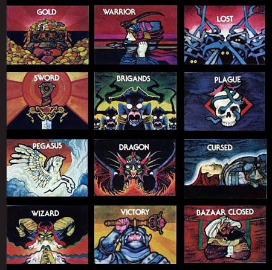

# 1d6 osr ultra lite + small dungeon

All rolls are made with 1d6; max level on any class is 4.  
All weapons do d6 damage, you don't roll to hit, armor reduces damage.  
Start with d6 hp, every rest re-roll and take the highest amount.

* fighter: you get +lvl damage and hp, chance of hitting first (if your enemy has the initiative) or number of targets you can hit on a single strike
* thief: +level chance to nimble stunts; +level uses/day of ninja tricks (log decoy, hidden weapons, perfect camouflage, a shadow double and smoke bombs)
* mage: 1+level chance in 6 of perceiving auras/scrying/casting, and lvl spells:

1. bless (mend things, bar a place, +d6 hp, +1 armor or damage, hide somone),
2. summon (Can be physical or an ethereal force; will perform an minor act or deal d6 damage and go on it's own way. Choose one: can perform greater magic; has a useful ability or you retain control after the summon (so you can banish it without effort or ask for another favor)
3. tame (roll a d6 and match target's HP: on a success, its confused, charmed or asleep. Else, deal that amount of weariness damage),
4. morph. (you get an alternate shape: it can be animal, plant-like, gaseous, monstruous or other. In this shape you get a weird related ability or +d6 temporal hp; OR you can choose to be a monster, who can morph as a human \*o\*)

Spells drain 1 hp; 3 on a failure. Reaching 0 HP might give the magical forces control over you.

All non-covered checks:

1 in 6 chance for difficult things  
4 in 6 chance for common stunts or anything covered by your background

1. noble
2. woodsman
3. bard
4. investigator
5. doctor
6. artificer

Duplicate results: 7. MONSTER

(You can roll to see if a specific background - related object is in your person)

<small>Awesome art by Bob Pepper</small>

* roll 1d6 for each dungeon encounter and start counting from the Gold Square. Then, you count from the last result that came up.
* If something seems too easy, roll again and add the result to the situation. If something feels played out, cross it and do not count it in further exploration.
* The first time victory comes up, it's a magical artifact. The second, it means that there is no more dungeon to explore.

What exactly the rest of the squares mean is up to you.

Alternativelly, print this image and cut through the black lines. Shuffle the 12 resulting cards and use them as random encounters. After the game, you'll also have lots of pretty cards lying around, and can even gift them to your players. You'll never be sorry to print something so badass.

----

Source: http://daylands.blogspot.fr/2017/11/1d6-osr-ultra-lite-small-dungeon.html
