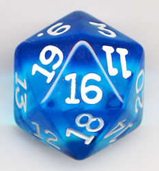

# The Shower Hack

## Stupid Shower Thought for The Black Hack

For peeps who are into this sort of thing in their role-playing games, a class-free approach to TBH's core system:

* 3d6 stats like normal
* d8 base hit die.
* Choose a background / profession / concept / aspect / descriptor /whatever the hell makes you feel cool. Whenever you perform actions related to this nonsense, you have advantage.
* Balance it out with an equally cool fucked up fault / disadvantage/ hindrance / whatever nonsense you label it as. Any time this complication comes up in game, you have disadvantage.

You may forfeit this nonsense to simply have a d10 hit die.  
You may lower your hit die a step to know magic/have psychic powers/whatever the damn cool super traits of your particular setting are.

That's all I have. We'll end this with a random pic of a d20 off Google Images.

----

source: https://plus.google.com/+Chaosgrenade/posts/3LWtMTBKmm3
